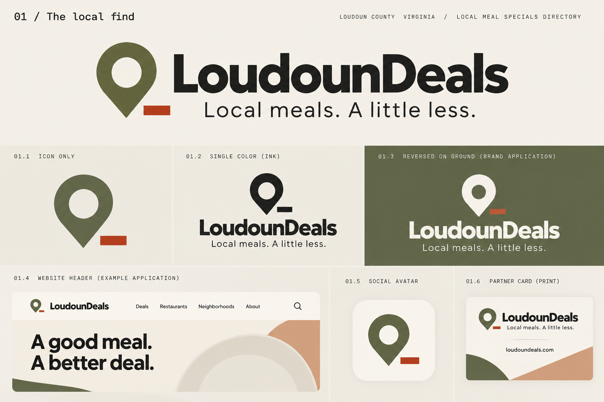
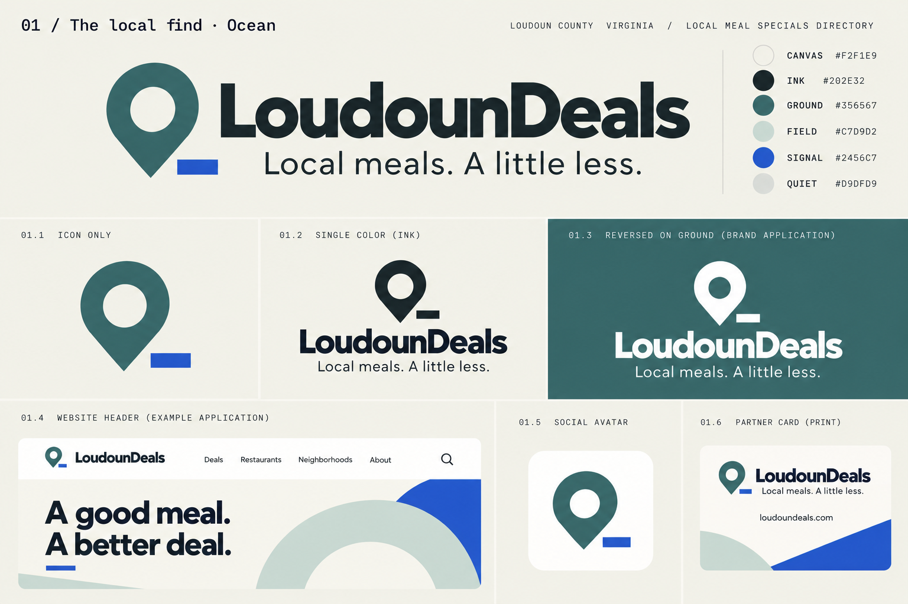
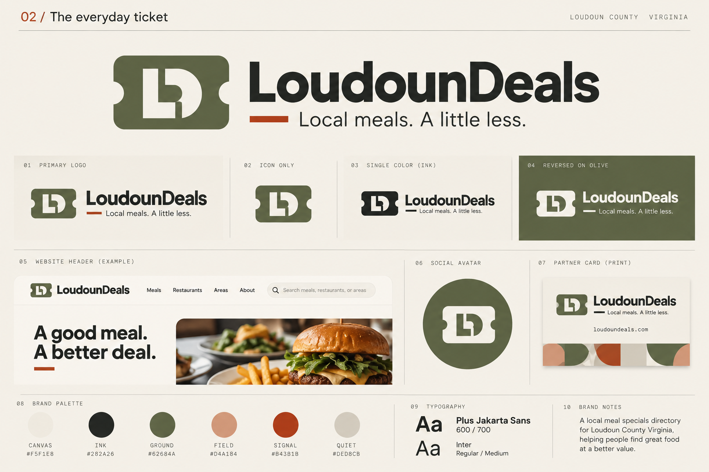
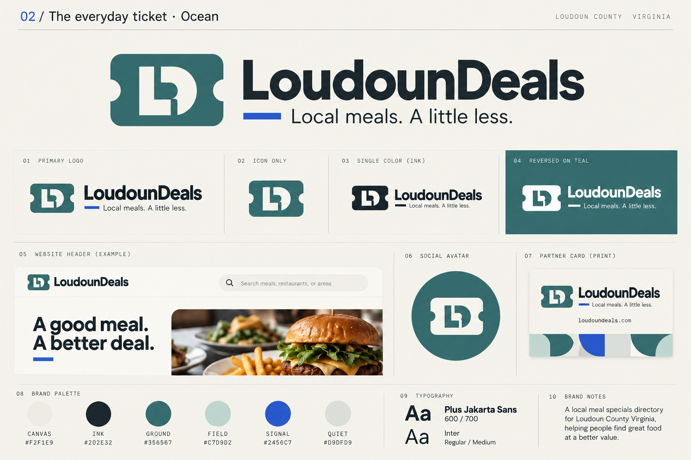
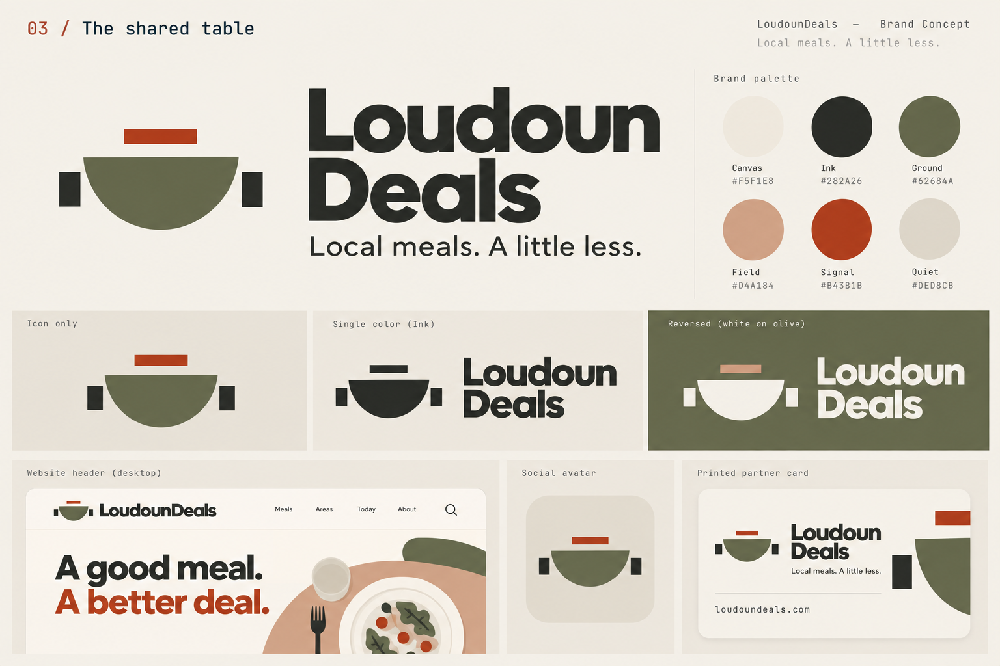
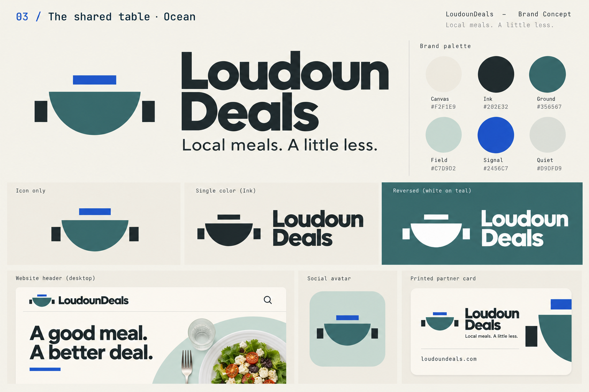

# LoudounDeals vision boards

These three directions apply Scott Brand System v1.0 to LoudounDeals. Local is the default identity. Ticket and Table are URL-selected alternatives. Each has a Hearth version and an otherwise identical Tidal/Ocean clone. [Choose a template](../../TEMPLATES.md).

## Local · The local find

The pin communicates nearby discovery. Use the horizontal name and pin in the website header; the isolated pin suits avatars and small placements. Keep the Signal accent on Canvas; use an entirely single-color mark for monochrome or reversed applications. Implemented as `ui=local` and `ui=local-ocean`. The current Local iteration retains this logo and favicon while using its own generated taco photograph in a frame with one sweeping corner and Table-inspired tinted cards, with added price bands, town labels, and source buttons. The original vision boards above remain preserved as the identity's starting point.

## Ticket · The everyday ticket

A notched ticket contains an LD monogram. It emphasizes value and works well on newsletters and partner materials. It must not imply that the directory issues redeemable coupons. Implemented as `ui=ticket` and `ui=ticket-ocean`, with a food photograph, Quiet filter band, and notched offer cards.

## Table · The shared table

A semicircular table and two place markers express shared meals. Use the stacked name where vertical space allows; use a horizontal lockup for compact placements. Implemented as `ui=table` and `ui=table-ocean`, with an overhead meal hero framed by Field geometry, Quiet offer cards, and matching footer treatment. For reversed applications, use white for the entire symbol rather than the original board's clay accent.

## Application and provenance

[Ocean edition edit prompts](ocean-prompts.md) document the three palette adaptations and designer refinements.

The website now applies the boards through distinct headers, heroes, filters, offer cards, footers, and compact favicons. [Hero imagery provenance and prompts](hero-assets.md) record the new decorative photography. The layout uses real links to existing sections rather than the mockups' illustrative navigation.

[Implemented theme previews](previews/README.md) show desktop screenshots, mobile examples, offer cards, and favicons at actual sizes.

The boards were created with the built-in image generation tool on October 2, 2026; [the original prompts](prompts.md) preserve provenance. They are visual direction references, not exact production specifications. Website marks are original inline SVG drawings derived from the concepts, with live Plus Jakarta Sans name text and exact palette tokens. The mockup navigation and imagery are illustrative; they do not represent existing features. The website retains visible restrictions, sources, filters, and Ink prices.

The website's Ocean clones change only palette values: sand Canvas, deep Ink, teal Ground, sea-glass Field, cobalt Signal, and mist Quiet. The original boards show Hearth and remain preserved. The Ocean editions above were generated as separate edits on October 2, 2026, using each original as its reference. They retain the logo directions while refining presentation, using all-white reversed marks, Ink headlines, and updated palette keys. Mockup artwork may vary between editions; it is not a website implementation specification. Generated colors and typography are visual approximations; the exact tokens govern production assets. Local's larger cobalt decorative areas are campaign exploration; keep Signal sparse in the directory itself.

Keep at least one capital-letter height of clear space where practical. Do not distort marks or put text over them. Omit the tagline when space is limited. Independently verify small-size recognition before using the marks as favicons or embroidery. Preserve font licenses with redistributed fonts. Review recognizable similarities before release; generated artwork is not automatically cleared for every use.

[Brand application notes](../../BRAND.md) · [Project README](../../README.md)
