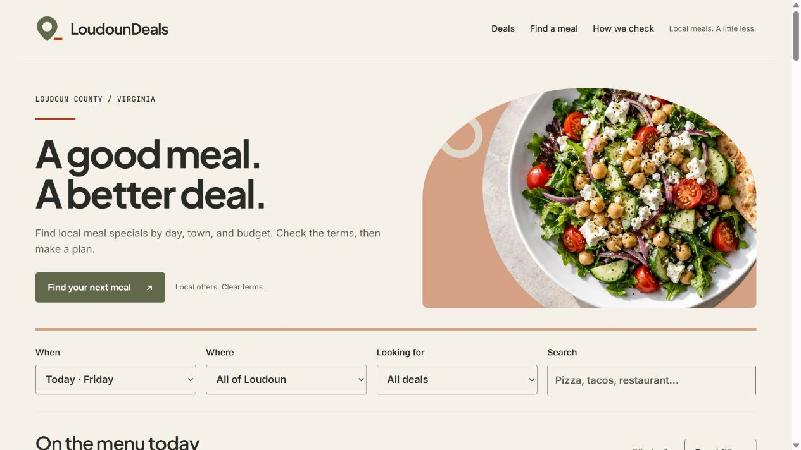
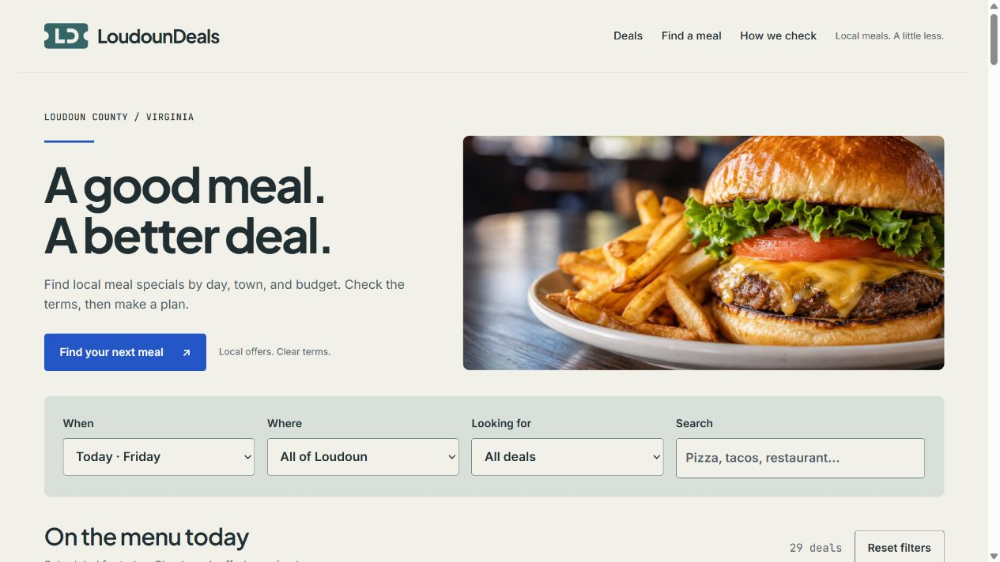
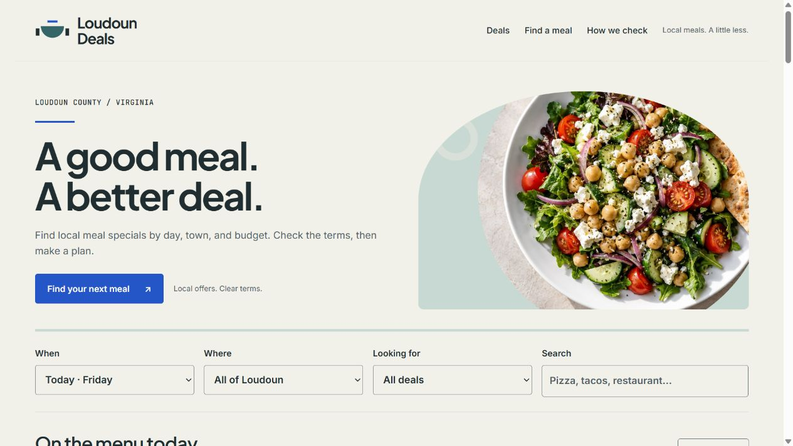
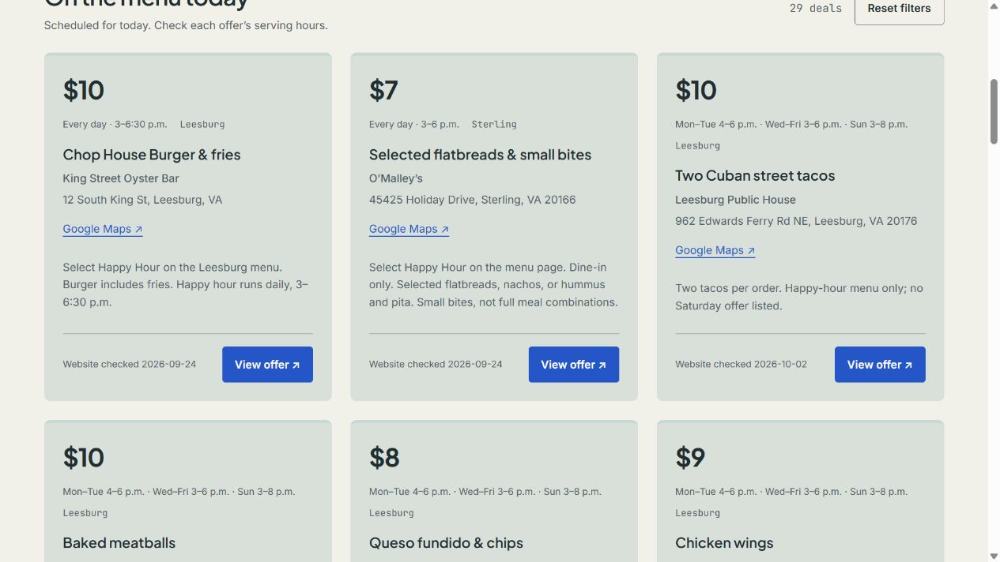
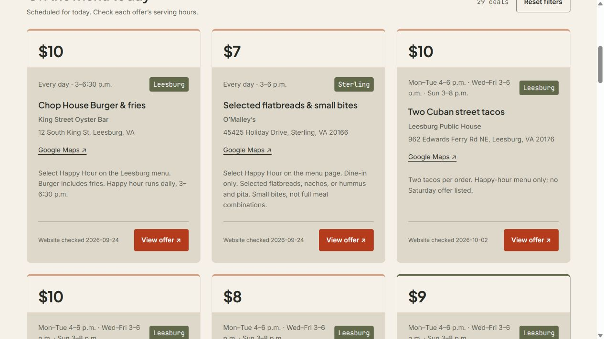
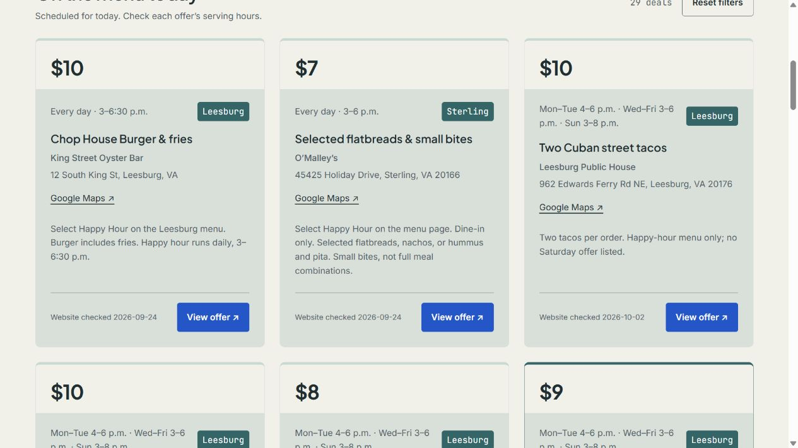
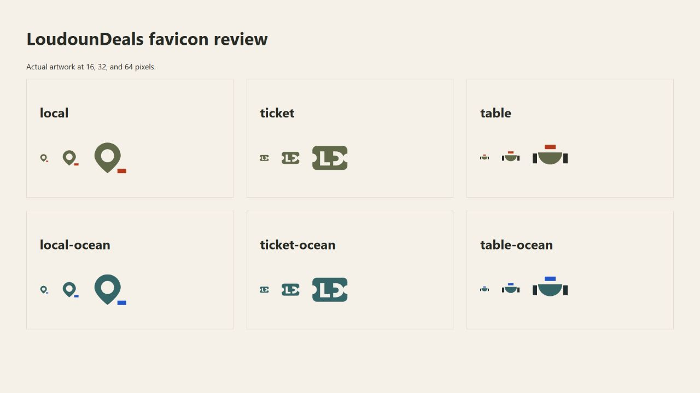

# Implemented theme previews

October 2, 2026 · Screenshots from the local build, not the published site. Desktop images use the browser's normal viewport; mobile images use a 320 px viewport. [Brand vision boards](../README.md) show the source directions.

| Theme | Desktop screenshot | Local interactive preview |
| --- | --- | --- |
| Local | [Local](local.jpg) | [Open Local](http://127.0.0.1:4173/?ui=local) |
| Ticket | [Ticket](ticket.jpg) | [Open Ticket](http://127.0.0.1:4173/?ui=ticket) |
| Table | [Table](table.jpg) | [Open Table](http://127.0.0.1:4173/?ui=table) |
| Local Ocean | [Local Ocean](local-ocean.jpg) | [Open Local Ocean](http://127.0.0.1:4173/?ui=local-ocean) |
| Ticket Ocean | [Ticket Ocean](ticket-ocean.jpg) | [Open Ticket Ocean](http://127.0.0.1:4173/?ui=ticket-ocean) |
| Table Ocean | [Table Ocean](table-ocean.jpg) | [Open Table Ocean](http://127.0.0.1:4173/?ui=table-ocean) |

Local interactive links require the development server (`npm run dev`).

## Desktop components

The refreshed Local pair retains its pin identity, uses Table-inspired photography and tinted cards, and reserves Signal for the primary View offer action. Those buttons have larger labels, 44 px minimum targets, and darker hover and pressed states.

## Mobile and favicon checks

[Local mobile](local-mobile.jpg) · [Local Ocean mobile](local-ocean-mobile.jpg) · [Ticket Ocean mobile](ticket-ocean-mobile.jpg) · [Table Ocean mobile](table-ocean-mobile.jpg)

[Standalone favicon specimen](favicons.html) preserves the actual icon SVGs used in this pass.

All six themes were checked at desktop width and 320 px: no horizontal document overflow; single-column hero and offers on narrow screens. The selected favicon and corresponding header/footer marks were verified. Ticket Ocean search with no results showed recovery guidance; Reset restored results while retaining `ui` and an unrelated campaign parameter. Keyboard navigation from Search reached Reset with a visible focus outline. The full test suite passed 32 tests, including compact favicon palette selection and safe production packaging of imagery and styles. Full screen-reader traversal, 200% text resizing, and forced-colors browser verification remain outside this recorded pass.

The primary View offer treatment was extended to all ten templates. Desktop and 320 px checks confirmed white labels on the correct palette accent, targets over 44 px tall, and no horizontal overflow. The Table Ocean card screenshot reflects this update.
